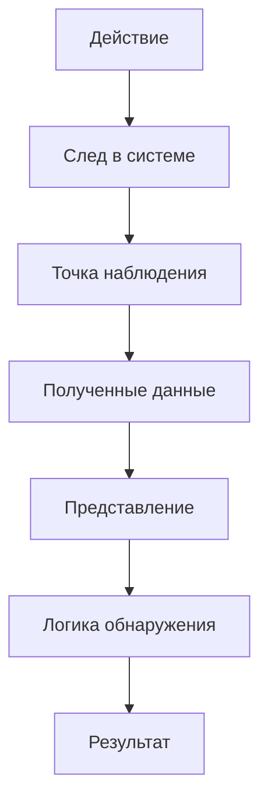
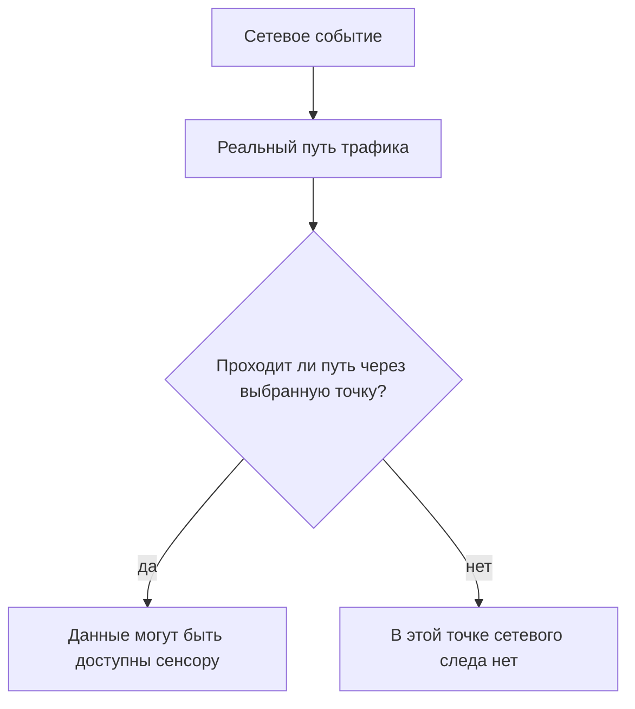

# 07. Основные формы интернет-преступности

Интернет-преступность проявляется через разные технические и социальные сценарии: фишинг и иные формы социальной инженерии, мошенничество, несанкционированный доступ, кражу учётных данных, распространение вредоносного ПО, атаки на веб-ресурсы и сервисы.

С точки зрения курса важна не классификация ради классификации, а способность разложить сценарий на действия и доступные следы. Например, фишинговое сообщение, переход по ссылке, ввод учётных данных и последующее использование сессии наблюдаются в разных точках и не подтверждаются одним источником.

Это подводит к ключевому принципу курса: сложный сценарий часто требует нескольких независимых источников и аккуратной корреляции.

## Один эпизод — несколько способов подтверждения

Фишинг, мошенничество, захват аккаунта и DDoS способны оставлять разные следы. Нажатие на ссылку может наблюдаться в почте, прокси и браузерных журналах; компрометация учётной записи потребует подтверждений из журналов аутентификации и действий пользователя. IDS видит только свои источники. Отсутствие сетевого alert не исключает событие на конечной системе.

## Контекст угроз, риска и следов

### От сценария угрозы к наблюдаемому следу

IDPS не получает абстрактный объект «атака» в готовом виде. Она получает **следы**, которые доступны её источнику данных и точке наблюдения.

<div class="idps-figure" markdown="1">
<div class="idps-figure__label">СХЕМА · ОТ ДЕЙСТВИЯ К ДАННЫМ ДЕТЕКТОРА</div>



<div class="idps-figure__caption">Курс будет постоянно возвращаться к этой цепочке. Между реальным действием и результатом IDPS есть несколько этапов, на каждом из которых возможны ограничения и потери наблюдаемости.</div>
</div>

Например, подбор паролей к веб-сервису может оставить серию HTTP-запросов, записи об ошибках аутентификации и события учётной записи. Сетевой сенсор, журнал приложения и хостовый агент получают **разные представления одного эпизода**. Ни одно из них автоматически не становится полной истиной о происходящем.

---


### Основные классы угроз и атак

Для базового анализа полезно различать не только названия атак, но и **какое свойство они затрагивают, какие слабости используют и какие следы оставляют**.

| Класс угрозы / сценария | Что происходит | Возможный наблюдаемый след | Какие меры могут снижать риск |
|---|---|---|---|
| Вредоносное ПО | запуск или распространение вредоносного кода | процесс, файл, сетевое соединение, изменение системы | обновления, защита конечных систем, ограничение привилегий, сегментация |
| Фишинг / социальная инженерия | пользователя убеждают раскрыть данные или выполнить действие | почтовые/веб-события, последующая аутентификация; сам разговор может быть вне телеметрии | обучение, MFA, фильтрация, контроль аутентификации |
| Подбор учётных данных | многократные попытки получить доступ | серия ошибок входа, множество запросов, блокировка учётной записи | MFA, rate limiting, блокировки, мониторинг |
| Перехват / подмена трафика | чтение или изменение сетевого обмена | изменения маршрута/сертификата/сеанса, необычные сетевые события — если источник способен их показать | шифрование, аутентификация узлов, защищённые протоколы |
| Инъекционные атаки | данные ввода интерпретируются как команда или запрос; типовой пример — SQL-инъекция | необычные HTTP/API-поля, ошибки приложения, SQL-журнал | безопасная разработка, параметризация, WAF как дополнительный слой |
| DoS / DDoS | ресурс перегружается запросами или потоками | рост частоты/объёма, исчерпание ресурсов, ошибки доступности | фильтрация, rate limiting, резервирование, anti-DDoS |
| Внутренняя угроза | легитимный пользователь злоупотребляет доступом или ошибается | массовый доступ, копирование, изменение конфигурации | наименьшие привилегии, аудит, DLP/EDR, разделение обязанностей |
| Облачный сценарий | ошибки доступа, секретов, конфигурации или внешних зависимостей | облачные audit logs, события IAM/API, сетевые и прикладные логи | IAM, MFA, безопасная конфигурация, журналирование, шифрование |
| IoT-сценарий | слабозащищённое устройство используется для доступа или ботнета | новые соединения, необычный трафик, изменение поведения устройства | инвентаризация, сегментация, обновления, контроль доступа |

### Атака и нарушаемое свойство

Один сценарий может затрагивать несколько свойств сразу. Но для первичного объяснения полезна такая карта:

- атаки на **конфиденциальность**: несанкционированное чтение, кража данных, шпионаж;
- атаки на **целостность**: изменение данных, конфигурации, маршрутизации или программного состояния; примером сетевой подмены может быть изменение DNS-ответа/направления разрешения имён;
- атаки на **доступность**: DoS/DDoS, уничтожение ресурсов, блокирование данных;
- атаки на **контроль доступа**: подбор паролей, кража учётных данных, обход аутентификации.

Не следует превращать эту карту в жёсткую классификацию: например, ransomware одновременно затрагивает доступность, целостность и иногда конфиденциальность.

---


### Киберпреступность: объект, способ и мотивация

**Киберпреступность** в учебном контексте охватывает противоправные действия, где компьютер, сеть, данные или цифровой сервис выступают целью, средством или средой совершения действия. Для специалиста важно не смешивать техническую фиксацию события с юридической квалификацией.

```text
правовая / социальная квалификация действия
                    ≠
технический наблюдаемый след
```

IDPS может предоставить технические факты для анализа, но не определяет автоматически состав правонарушения, виновность, мотив или личность нарушителя.

### Что может быть объектом или результатом киберпреступления

- несанкционированный доступ к системе или данным;
- кража, изменение, уничтожение или блокирование информации;
- мошенническое получение денег или учётных данных;
- распространение вредоносного ПО;
- шпионаж и скрытый сбор информации;
- использование цифровых сервисов для угроз, шантажа или преследования;
- незаконное распространение защищаемого контента;
- злоупотребление платёжными и цифровыми финансовыми механизмами.

### Кто может выступать источником действий

В учебных сценариях встречаются внешний нарушитель, инсайдер и организованная группа. Мотивация может быть финансовой, личной, конкурентной, идеологической или иной. Но эти характеристики **не выводятся из одного alert**: для атрибуции требуются дополнительные независимые данные.

### Противодействие киберпреступности не только техническое

Комплексный ответ включает:

- технические меры: MFA, шифрование, межсетевое экранирование, IDPS, защита конечных систем;
- организационные меры: политики, управление доступом, обучение, процессы реагирования;
- расследование и сохранение доказательств;
- правовые процедуры и взаимодействие компетентных органов;
- международное сотрудничество, когда действия и инфраструктура находятся в разных юрисдикциях.

Для международного контекста часто рассматривается Будапештская конвенция о киберпреступности, а в трансграничных расследованиях могут участвовать национальные органы и международные структуры сотрудничества, включая INTERPOL и Europol. Требования к обработке и защите данных зависят от юрисдикции; например, GDPR регулирует защиту персональных данных в Европейском союзе, но не является «законом о киберпреступности». В этом курсе такие примеры нужны только для понимания правового и трансграничного контекста; курс не заменяет юридическую дисциплину.

---


### Основные формы интернет-преступности и их технический след

| Форма / сценарий | Что происходит | Что потенциально можно наблюдать | Чего IDPS не доказывает |
|---|---|---|---|
| Фишинг, вишинг, смишинг | человека обманом склоняют раскрыть данные или выполнить действие | письмо/URL/DNS/прокси, последующий вход; голосовой контакт может отсутствовать в телеметрии | факт обмана конкретного человека только по сетевому alert |
| Интернет-мошенничество | используются поддельные ресурсы, объявления или похищенные данные | веб- и DNS-события, аутентификация, бизнес-журналы | сам факт финансового ущерба без транзакционного контекста |
| Кибершпионаж | скрыто собираются конфиденциальные сведения | доступ к файлам, процессы, сетевые соединения, выгрузка данных | организационную принадлежность и мотив субъекта |
| Кибербуллинг / онлайн-угрозы | сообщения и действия направлены против человека | журналы платформы, если они доступны | правовую квалификацию содержания из обычного сетевого трафика |
| Вредоносное ПО | устройство заражается или используется для дальнейших действий | файлы, процессы, persistence, сетевые соединения | что конкретный образец автоматически относится к определённому семейству без анализа |
| DDoS | множество источников или потоков создают отказ в обслуживании | частота, объём, число источников, ошибки сервиса, инфраструктурные метрики | мотивацию и заказчика атаки |
| Несанкционированный доступ | обходится контроль доступа или используются похищенные учётные данные | аутентификация, сессии, изменения прав, доступ к ресурсам | личность пользователя за учётной записью без дополнительных данных |
| Нарушение интеллектуальной собственности | защищаемый контент распространяется или используется без разрешения | факт передачи или публикации в конкретной системе | наличие/отсутствие прав на этот контент без внешнего контекста |
| Финансовые / криптовалютные преступления | похищаются средства либо используются мошеннические схемы | транзакции, аутентификация, устройства, сетевые и бизнес-события | мошеннический характер операции только по сетевой телеметрии |

Рассмотрим последовательность, которая непосредственно связана с задачами нашего курса:

```text
фишинговое сообщение
      ↓
кража учётных данных
      ↓
вход под легитимной учётной записью
      ↓
доступ к внутреннему сервису
      ↓
копирование данных
```

Для специалиста по IDPS полезны вопросы:

1. Какой технический факт должен произойти на каждом этапе?
2. Какой след он оставит?
3. Где этот след можно наблюдать?
4. Какой источник данных способен его представить?
5. Какое условие обнаружения можно проверить?
6. Какой вывод обоснован evidence, а какой требует внешнего контекста?

---


## Приложения, веб-сервисы и их следы

### Подбор учётных данных и злоупотребление аутентификацией

Веб-сервисы сталкиваются с:

- перебором паролей;
- использованием ранее скомпрометированных пар логин/пароль;
- массовыми повторными попытками входа;
- входами с необычного контекста.

Здесь особенно хорошо видна разница между источниками:

```text
сетевой сенсор
→ частота и свойства запросов

журнал приложения / система аутентификации
→ результат аутентификации, пользователь, причина отказа

контекст учётной записи
→ обычное/необычное поведение, MFA, права
```

Фиксированный порог может выделить серию попыток, но не является автоматически аномальным обнаружением; этот принцип уже разбирался в Главе 5 и ЛР №4.

---


### DDoS и доступность веб-сервиса

DDoS направлен на нарушение доступности ресурса за счёт распределённой нагрузки. Наблюдать такой эпизод можно на нескольких уровнях:

- сетевые потоки и пакеты;
- балансировщик и обратный прокси;
- журналы веб-сервера;
- задержка и ошибки приложения;
- загрузка CPU/памяти/канала;
- метрики внешнего сервиса защиты.

Один показатель не является полной картиной. Большое число запросов не обязательно означает DDoS, а отсутствие alert IDPS не доказывает нормальную доступность сервиса.

---


### MITM и роль защищённого канала

Атака «человек посередине» (Man-in-the-Middle, MITM) предполагает возможность перехватывать и/или изменять взаимодействие между сторонами.

Для веб-сервисов TLS помогает обеспечивать конфиденциальность и целостность канала и аутентификацию сервера через сертификатный механизм. Но для сетевого IDPS это одновременно означает, что содержимое приложения может стать недоступно внешнему сенсору без предусмотренной точки расшифрования.

Таким образом, один механизм безопасности может одновременно:

```text
защищать данные пользователя
и
менять видимость для сетевого детектора
```

Это не противоречие, а архитектурный компромисс, который нужно учитывать при проектировании наблюдаемости.

---


## Размещение сенсоров и точки наблюдения

### Размещение определяет, какие данные вообще могут попасть в систему

В предыдущих главах мы разделили источник данных, обработку и логику обнаружения. Теперь появляется ещё одно условие, которое предшествует анализу.

<div class="idps-figure" markdown="1">
<div class="idps-figure__label">СХЕМА 1 · УСЛОВИЕ СЕТЕВОЙ НАБЛЮДАЕМОСТИ</div>



<div class="idps-figure__caption">Сначала проверяется физический или логический путь трафика. Настройка правила имеет смысл только после того, как нужные данные доступны в выбранной точке.</div>
</div>

Это не означает, что любое событие, прошедшее через точку, обязательно будет обнаружено. Между «трафик доступен» и «оповещение сформировано» остаются получение данных, представление и логика обнаружения.

<div class="idps-contrast">
  <div class="idps-card idps-card--observation">
    <span class="idps-card__eyebrow">РАЗМЕЩЕНИЕ</span>
    <strong class="idps-card__title">Видит ли выбранная точка нужный поток?</strong>
    <p>Это вопрос маршрута, интерфейса и способа получения данных.</p>
  </div>
  <div class="idps-contrast__arrow">≠</div>
  <div class="idps-card idps-card--sensor">
    <span class="idps-card__eyebrow">ОБНАРУЖЕНИЕ</span>
    <strong class="idps-card__title">Сработает ли на этих данных нужный детектор?</strong>
    <p>Это отдельный вопрос условий, правил и доступного представления данных.</p>
  </div>
</div>

Первый вопрос относится к размещению и получению данных. Второй — к обнаружению. Смешение этих вопросов приводит к типичной ошибке: отсутствие оповещения принимают за доказательство отсутствия трафика.

---


### Что такое точка наблюдения

**Точка наблюдения** — конкретное место, в котором система получает интересующие данные о сетевом взаимодействии.

Для инженерного описания фразы «IDS стоит в сети» недостаточно. Нужно описать точку так, чтобы другой специалист понимал, **какой именно поток и где мы ожидаем увидеть**.

<div class="idps-figure">
  <div class="idps-figure__label">СХЕМА · ПАСПОРТ ТОЧКИ НАБЛЮДЕНИЯ</div>
  <div class="idps-placement-spec">
    <div><span>01</span><strong>Сегмент / интерфейс</strong><small>Где физически или логически получаются данные?</small></div>
    <div><span>02</span><strong>Направление</strong><small>Какой обмен нас интересует: A → B, B → A или оба направления?</small></div>
    <div><span>03</span><strong>Положение</strong><small>До/после какого сетевого устройства или границы находится точка?</small></div>
    <div><span>04</span><strong>Конкретный поток</strong><small>Какой адрес, сервис или сетевое взаимодействие должно здесь проходить?</small></div>
  </div>
  <div class="idps-figure__caption">Название продукта или сервера не описывает точку наблюдения. Нужна привязка к пути конкретного трафика.</div>
</div>

Например, запись:

```text
NIDS на сервере
```

почти ничего не объясняет.

Гораздо точнее:

```text
интерфейс учебной сети idps-server;
сегмент 10.13.37.0/24;
наблюдается трафик idps-client → idps-server:8080.
```

<div class="callout-banner">
<strong>Главное правило:</strong> точку наблюдения выбирают относительно конкретного сетевого пути, а не относительно абстрактного понятия «периметр» или «серверная».
</div>

---


## Проверьте себя

Выберите ответ. После выбора появится пояснение. При необходимости перечитайте соответствующий раздел этой же темы.

<div class="quiz" data-question-id="topic07-q1">
  <p><strong>Письмо с фишинговой ссылкой попало в почтовый шлюз. Что дальше?</strong></p>
  <button type="button" data-choice="0">А. Считать аккаунт захваченным</button>
  <button type="button" data-choice="1" data-correct="true">Б. Проверить переходы и логины</button>
  <button type="button" data-choice="2">В. Сразу признать утечку данных</button>
  <button type="button" data-choice="3">Г. Ограничиться результатом фильтра URL на шлюзе</button>
  <div class="quiz-feedback" data-explanation="Доставка письма не доказывает переход по ссылке или захват учётной записи." aria-live="polite"></div>
</div>

<div class="quiz" data-question-id="topic07-q2">
  <p><strong>Почему одной NIDS недостаточно для анализа фишинга?</strong></p>
  <button type="button" data-choice="0">А. NIDS получает сетевые данные, а не все действия пользователя</button>
  <button type="button" data-choice="1" data-correct="true">Б. Почтовые и endpoint-следы дополняют сеть</button>
  <button type="button" data-choice="2">В. NIDS не может проверить факт взаимодействия с приложением</button>
  <button type="button" data-choice="3">Г. Почтовый шлюз всегда видит события на конечном узле</button>
  <div class="quiz-feedback" data-explanation="Фишинг может оставлять важные следы в почте, браузере и журнале аутентификации." aria-live="polite"></div>
</div>

<div class="quiz" data-question-id="topic07-q3">
  <p><strong>При DDoS что нужно подтвердить помимо всплеска трафика?</strong></p>
  <button type="button" data-choice="0" data-correct="true">А. Фактический эффект на доступность</button>
  <button type="button" data-choice="1">Б. Только совпадение с известным адресом источника</button>
  <button type="button" data-choice="2">В. Только количество пакетов, не проверяя целевой сервис</button>
  <button type="button" data-choice="3">Г. Только наличие сигнатурного alert при высокой нагрузке</button>
  <div class="quiz-feedback" data-explanation="Большой объём запросов сам по себе не доказывает отказ услуги." aria-live="polite"></div>
</div>

## Навигация

[← Тема 06](./06-anomaly-malware.md) · [Все 15 тем](../syllabus/index.md) · [Тема 08 →](./08-ips-principles.md)

