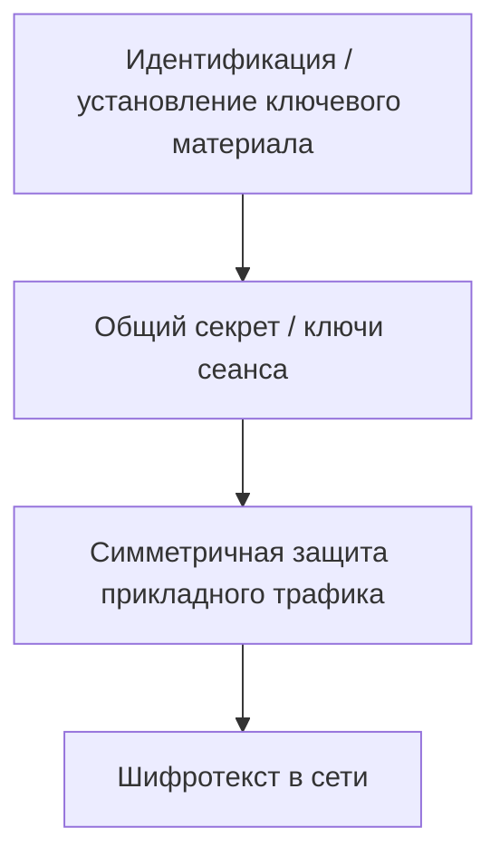

# 10. Шифрование данных. Симметричное и асимметричное шифрование

Шифрование преобразует открытые данные в шифротекст с использованием алгоритма и ключа. Симметричное шифрование использует общий секрет и эффективно для больших объёмов данных; асимметричное использует пару открытого и закрытого ключей и помогает решать задачи обмена ключами, аутентификации и цифровой подписи.

На практике эти подходы часто комбинируются: асимметричные механизмы участвуют в установлении доверия и согласовании секретов, а симметричные — защищают основной поток данных.

Для IDPS шифрование важно ещё и как граница наблюдаемости: сетевой сенсор может видеть метаданные соединения, но не всегда получает доступ к прикладному содержимому. Поэтому отсутствие видимого payload не означает отсутствие каких-либо наблюдаемых признаков.

## Криптография меняет наблюдаемость, а не уничтожает её

Шифрование снижает видимость содержимого на внешнем сетевом сенсоре, но в зависимости от протокола и конфигурации могут оставаться метаданные потока, часть рукопожатия и признаки поведения. Для анализа защищённого приложения используйте при необходимости разрешённые endpoint/app logs. Нельзя считать, что сертификат сам по себе доказывает безопасность приложения или что шифрованный поток принципиально недоступен любому анализу.

## Сетевые протоколы и наблюдаемость

### Перед TLS: криптографический минимум

Чтобы понимать, почему зашифрованный трафик меняет наблюдаемость IDPS, достаточно разделять несколько базовых понятий.

- **Открытый текст** — исходные данные до криптографического преобразования.
- **Шифротекст** — результат шифрования, который без требуемого ключевого материала не должен раскрывать исходное содержимое.
- **Шифр / алгоритм шифрования** — формализованный алгоритм преобразования данных.
- **Ключ** — параметр криптографического алгоритма, от которого зависит конкретное преобразование.

### Симметричное шифрование

При симметричном шифровании стороны используют общий секретный ключ или связанный секретный ключевой материал. Такой подход хорошо подходит для защиты больших объёмов трафика.

Пример алгоритма — **AES (Advanced Encryption Standard)**. В учебной литературе часто встречается также DES как исторический пример; сегодня он нужен прежде всего для понимания эволюции алгоритмов, а не как рекомендуемый вариант для современной защиты.

### Асимметричная криптография

Асимметрические механизмы используют пару связанных ключей: **открытый** и **закрытый**. Они применяются, например, для цифровых подписей, аутентификации и механизмов установления общего секрета.

Как примеры публично-ключевой криптографии полезно знать **RSA** и **ECC** (криптография на эллиптических кривых). Важно не превращать это в формулу «асимметричным алгоритмом всегда шифруют весь сетевой трафик»: защищённые протоколы обычно используют сочетание механизмов.

| Свойство | Симметричные механизмы | Асимметричные механизмы |
|---|---|---|
| Ключи | общий секретный ключ/ключевой материал | связанная пара открытого и закрытого ключей |
| Производительность | обычно эффективны для больших объёмов данных | вычислительно тяжелее для массового шифрования |
| Основная проблема | безопасное получение общего секрета сторонами | доверие к открытому ключу и защита закрытого ключа |
| Типичное применение | защита основного потока данных | аутентификация, цифровые подписи, установление ключевого материала |

Криптография применяется не только в сетевых протоколах: она также используется для защиты файлов и баз данных, электронных подписей и других задач конфиденциальности, целостности и аутентичности. В этой главе нас интересует прежде всего влияние защищённого сетевого канала на видимость IDPS.

<div class="idps-figure" markdown="1">
<div class="idps-figure__label">СХЕМА · ПОЧЕМУ ЗАЩИЩЁННЫЙ КАНАЛ КОМБИНИРУЕТ МЕХАНИЗМЫ</div>



<div class="idps-figure__caption">Это концептуальная схема. Конкретный протокол определяет точные криптографические механизмы, сообщения и наборы алгоритмов.</div>
</div>

Для IDPS отсюда следует главный практический вопрос:

```text
где находится точка наблюдения
и
видит ли она данные до шифрования,
после расшифрования
или только защищённое сетевое представление?
```

Шифрование не уничтожает сам факт соединения, но меняет набор полей, доступных внешнему наблюдателю. Поэтому следующий раздел рассматривает TLS уже не как «чёрный ящик», а как конкретный пример изменения наблюдаемости.


### TLS 1.3: после шифрования меняется не событие, а доступный сенсору слой

TLS создаёт защищённый канал между сторонами. Для TLS 1.3 актуальная спецификация — RFC 9846. Имена сообщений `ClientHello` и `ServerHello` оставляем без перевода: это буквальные названия структур в TLS-спецификации, и студент должен узнавать их в RFC и инструментах анализа.

Для внешнего сетевого сенсора без ключей или архитектурно предусмотренного расшифрования принципиально важно различать:

```text
метаданные соединения
≠
содержимое прикладного протокола внутри TLS
```

В TLS 1.3 значительная часть процедуры установления соединения после `ServerHello`, включая сертификат сервера, защищена. Прикладные данные (`application data` в терминологии RFC 9846) также шифруются. Английское название здесь нужно только для сопоставления с полями и формулировками спецификации.

При этом до и во время установления соединения отдельные метаданные могут оставаться наблюдаемыми. Конкретный набор зависит от версии протокола, расширений, точки наблюдения и возможностей реализации IDPS.

Если TLS-соединение завершается на обратном прокси, балансировщике или другом промежуточном компоненте, будем говорить о **точке завершения TLS**. Само наличие такой точки ещё не означает, что сетевой сенсор автоматически получает расшифрованное содержимое.

Suricata, например, может журналировать различные TLS-поля и отпечатки соединений. Но наличие такого поля в документации продукта не означает, что оно гарантированно присутствует в каждом соединении.

<div class="idps-grid idps-grid--3">
  <div class="idps-card idps-card--source"><span class="idps-card__eyebrow">ДОСТУПНОЕ ПРЕДСТАВЛЕНИЕ</span><strong class="idps-card__title">Сетевые признаки и признаки установления TLS</strong><p>Адреса, порты, объём, временные характеристики и отдельные доступные поля установления защищённого канала.</p></div>
  <div class="idps-card idps-card--warning"><span class="idps-card__eyebrow">ЗАЩИЩЁННЫЙ СЛОЙ</span><strong class="idps-card__title">Прикладные данные</strong><p>URI, тело HTTP-запроса и другие внутренние данные не становятся открытой полезной нагрузкой только потому, что сенсор находится на пути.</p></div>
  <div class="idps-card idps-card--result"><span class="idps-card__eyebrow">СЛЕДСТВИЕ</span><strong class="idps-card__title">Меняется класс возможных правил</strong><p>Правило по URI и правило по TLS-метаданным отвечают на разные вопросы и поддерживают разные выводы.</p></div>
</div>

---


### ECH показывает, почему даже метаданные нельзя считать вечной гарантией

В Главе 7 уже было введено **указание имени сервера (SNI)** из `ClientHello`. Это поле широко использовалось сетевыми средствами наблюдения как признак имени сервера; здесь важна уже не терминология, а изменение доступности самого поля.

Но RFC 9849 определяет уже введённый в Главе 7 механизм **зашифрованного `ClientHello` (ECH)**. `ClientHello` остаётся без перевода, потому что это буквальное имя сообщения TLS. ECH позволяет защищать внутренний `ClientHello`, включая чувствительные расширения, такие как SNI и **согласование протокола прикладного уровня (Application-Layer Protocol Negotiation, ALPN)**. `ALPN` появляется здесь впервые; английское название приведено для происхождения аббревиатуры из TLS-спецификации. По смыслу этот механизм позволяет сторонам согласовать прикладной протокол.

При этом ECH не означает «в сети больше нет никаких TLS-метаданных»: внешний `ClientHelloOuter` и свойства внешнего соединения остаются наблюдаемыми, а конкретно доступные значения внешнего `ClientHelloOuter` зависят от конфигурации и сценария. Корректный вывод уже не «SNI всегда виден» и не «ECH скрывает вообще всё», а **нужно установить, какое именно представление доступно в данном соединении**.

Это важный урок шире самого TLS:

<div class="principle-box">
<strong>МЕТАДАННЫЕ — ТОЖЕ ЧАСТЬ КОНКРЕТНОГО ПРЕДСТАВЛЕНИЯ</strong>
<p>Нельзя проектировать долгоживущую логику обнаружения из предположения, что определённое поле «всегда видно в сети». Его доступность зависит от эволюции протокола, конфигурации и архитектуры наблюдения.</p>
</div>

Поэтому условие вида «если SNI содержит X» должно документировать предпосылку:

```text
SNI должен быть доступен выбранному сенсору в анализируемом соединении.
```

Без этой предпосылки отсутствие совпадения нельзя автоматически трактовать как отсутствие обращения к интересующему сервису.

---


### QUIC и HTTP/3 ломают привычку мыслить только моделью «TCP-поток → анализ HTTP»

QUIC определён как защищённый транспортный протокол поверх UDP. Он предоставляет потоки, мультиплексирование, управление соединением и криптографическую защиту как часть собственной транспортной модели.

HTTP/3, в свою очередь, отображает семантику HTTP на QUIC.

Для IDPS это означает архитектурный сдвиг:

```text
HTTP/1.1 поверх TCP
состояние TCP → восстановление потока → анализ HTTP

HTTP/2 поверх TLS/TCP
состояние TCP → TLS → представление HTTP/2 (при доступе к содержимому)

HTTP/3 поверх QUIC/UDP
состояние соединения QUIC → защищённые потоки QUIC → представление HTTP/3
```

<div class="teaching-figure">
<div class="figure-label">ВИЗУАЛЬНАЯ МОДЕЛЬ 4 · HTTP/3 НЕ ЯВЛЯЕТСЯ «HTTP В ОБЫЧНОЙ ПОЛЕЗНОЙ НАГРУЗКЕ UDP»</div>
<div class="idps-process">
  <div class="idps-process__step idps-process__step--source"><span>1</span><strong>UDP-дейтаграммы</strong><small>внешний транспортный слой для QUIC</small></div>
  <div class="idps-process__arrow">→</div>
  <div class="idps-process__step"><span>2</span><strong>QUIC</strong><small>идентификаторы соединений, типы пакетов, потоки и криптографическая защита</small></div>
  <div class="idps-process__arrow">→</div>
  <div class="idps-process__step idps-process__step--sensor"><span>3</span><strong>HTTP/3</strong><small>семантика HTTP отображается на потоки QUIC</small></div>
  <div class="idps-process__arrow">→</div>
  <div class="idps-process__step idps-process__step--result"><span>4</span><strong>Представление для обнаружения</strong><small>зависит от того, что конкретная реализация умеет распознать и получить</small></div>
</div>
<div class="figure-caption">UDP-порт 443 не даёт сетевому правилу открытый HTTP-запрос. Сначала нужен корректный разбор QUIC и доступ к соответствующему представлению.</div>
</div>

Suricata 8.x распознаёт QUIC как отдельный протокол прикладного уровня и предоставляет ограниченные поля, специфичные для QUIC. Это полезный пример, но не основание считать, что любой NIDS автоматически имеет полную видимость прикладных данных HTTP/3.

---


## Слепые зоны и границы выводов

### Шифрование меняет доступное представление, а не уничтожает все наблюдения

Шифрование меняет то, какое представление доступно сетевому сенсору.

Рассмотрим сенсор на пути **HTTPS**, то есть HTTP-соединения, защищённого TLS. Отдельное английское раскрытие для `HTTPS` здесь не требуется: в курсе это обозначение используется именно как стандартная схема «HTTP поверх TLS», а оба базовых протокола уже введены в Главе 1.

Для незашифрованного HTTP ему потенциально доступны прикладные поля:

```text
метод HTTP;
URI;
заголовки;
часть или всё тело запроса/ответа — в зависимости от точки и возможностей движка.
```

После установления TLS прикладные HTTP-данные защищены шифрованием. Для внешнего сетевого сенсора без расшифрования путь `/admin/export` уже не является просто доступной строкой сетевого содержимого. В англоязычной документации полезную нагрузку пакета или сообщения часто называют `payload`; термин приведён только для узнавания документации, далее используется русское «содержимое» или «полезная нагрузка».

В спецификации TLS буквальными именами сообщений процедуры установления соединения являются `ClientHello` и `ServerHello`: первое отправляет клиент, второе является ответом сервера. Эти имена не переводятся в коде и ссылках на RFC, поэтому вводятся здесь один раз перед дальнейшим использованием.

<div class="idps-grid idps-grid--3">
  <div class="idps-card idps-card--success"><span class="idps-card__eyebrow">НЕЗАШИФРОВАННЫЙ HTTP</span><strong class="idps-card__title">Прикладное содержимое потенциально доступно</strong><p>Метод, URI, заголовки и другое представление могут быть разобраны сетевым движком.</p></div>
  <div class="idps-card idps-card--warning"><span class="idps-card__eyebrow">TLS 1.3</span><strong class="idps-card__title">Содержимое приложения защищено</strong><p>После ServerHello последующие сообщения процедуры установления соединения защищены, а прикладные данные передаются в зашифрованном виде.</p></div>
  <div class="idps-card idps-card--observation"><span class="idps-card__eyebrow">МЕТАДАННЫЕ</span><strong class="idps-card__title">Часть признаков может оставаться наблюдаемой</strong><p>IP/порт, направление, размеры, время, а также некоторые свойства TLS — в зависимости от версии протокола и конфигурации.</p></div>
</div>

Актуальная спецификация TLS 1.3, RFC 9846 (она заменяет RFC 8446), устанавливает, что сообщения процедуры установления TLS-соединения после `ServerHello` защищаются шифрованием. Это означает не «сетевой IDS больше ничего не видит», а более точное утверждение:

<div class="principle-box">
<strong>ШИФРОВАНИЕ СКРЫВАЕТ ЧАСТЬ ПРЕДСТАВЛЕНИЯ</strong>
<p>Сетевой сенсор может продолжать видеть сам факт соединения и часть метаданных, но правило, которому нужен скрытый HTTP URI или другое содержимое приложения, не получает прежнего представления без дополнительной архитектуры расшифрования или другого источника данных.</p>
</div>

---


### Метаданные тоже не являются неизменной гарантией

Классический `ClientHello` может содержать открытое **указание имени сервера (Server Name Indication, SNI)**. Английское название приведено потому, что `SNI` — устоявшаяся аббревиатура TLS-расширения в спецификациях и инструментах. Поэтому даже после введения этого термина нельзя запоминать формулу «при TLS SNI виден всегда». Suricata умеет регистрировать и проверять такие TLS-поля, а также дополнительные отпечатки соединения при соответствующей конфигурации.

Но современный механизм **зашифрованного `ClientHello` (Encrypted Client Hello, ECH)**, стандартизованный RFC 9849, предназначен именно для защиты SNI и других чувствительных полей `ClientHello`. Английское название сохранено потому, что `ECH` — буквальное имя механизма и общепринятая аббревиатура в RFC и документации.

Поэтому корректная модель выглядит так:

<div class="idps-question-model">
  <div class="idps-question-model__cell"><span>НАДЁЖНО ДОСТУПНО НА СЕТЕВОМ ПУТИ</span><strong>только то, что реально остаётся наблюдаемым в данном протоколе и данной точке</strong></div>
  <div class="idps-question-model__cell"><span>МОЖЕТ БЫТЬ ДОСТУПНО</span><strong>TLS-метаданные, SNI, согласованный прикладной протокол, отпечаток соединения и другие поля — если они не защищены и движок их получает</strong></div>
  <div class="idps-question-model__cell"><span>НЕ СЛЕДУЕТ ПРЕДПОЛАГАТЬ</span><strong>что любой домен, URI, сертификат или прикладное содержимое всегда видны любому сетевому IDS</strong></div>
  <div class="idps-question-model__boundary"><strong>Вывод:</strong> видимость зависит от конкретного протокола, версии, расширений, места наблюдения и конфигурации системы.</div>
</div>

Именно поэтому правила должны опираться не на абстрактное «сетевой IDS это видит», а на проверяемое представление данных.

---


### Расшифрование — архитектурное решение, а не бесплатная функция IDS

Если организации необходимо анализировать содержимое зашифрованного трафика, возможны разные архитектурные подходы:

<div class="idps-grid idps-grid--4 idps-grid--compact">
  <div class="idps-card idps-card--observation"><strong class="idps-card__title">Наблюдение до шифрования</strong><p>Телеметрия приложения, прокси или компонента конечной системы в точке, где содержимое ещё доступно.</p></div>
  <div class="idps-card idps-card--sensor"><strong class="idps-card__title">Контролируемое расшифрование</strong><p>Специализированный прокси или компонент контролируемого расшифрования при допустимой архитектуре и политике организации.</p></div>
  <div class="idps-card idps-card--source"><strong class="idps-card__title">Хостовый источник</strong><p>Процесс, файл, системный журнал, антивирусная телеметрия или сведения средства обнаружения и реагирования на конечной системе (Endpoint Detection and Response, EDR) могут дать иной след того же эпизода. Английское название приведено только для происхождения распространённой аббревиатуры `EDR`; далее используется эта аббревиатура или русское описание.</p></div>
  <div class="idps-card idps-card--interpretation"><strong class="idps-card__title">Метаданные сети</strong><p>Когда содержимое недоступно, остаётся анализ доступных сетевых и временных признаков.</p></div>
</div>

Но это разные источники и разные точки доверия. Нельзя просто написать:

```text
HTTPS → IDS расшифрует
```

Расшифрование связано с управлением ключами, архитектурой доверия, производительностью, требованиями приватности и организационной политикой. В рамках этой главы важно только одно: **если детектору нужен признак внутри защищённого содержимого, нужно заранее определить, откуда этот признак реально будет получен**.

---


## Примеры анализа зашифрованных соединений

### Три контролируемых случая: как меняется допустимый вывод

### Случай A — открытый HTTP

Условие эксперимента:

```text
клиент отправляет GET /LAB9-VISIBLE
сенсор видит этот сетевой путь
протокольный анализатор распознаёт HTTP-транзакцию
```

Возможные артефакты нужно различать:

```text
событие HTTP/прикладного уровня → протокольный анализатор зафиксировал соответствующее HTTP-представление;
оповещение          → конкретное условие обнаружения выполнилось на доступном представлении.
```

Допустимый вывод при наличии соответствующего артефакта прикладного уровня:

> В данной точке наблюдения и конфигурации движок сформировал HTTP-представление, содержащее `/LAB9-VISIBLE`.

Если дополнительно получено оповещение нужного правила, можно отдельно утверждать:

> На этом представлении выполнилось конкретное условие обнаружения.

Событие прикладного уровня и оповещение не нужно сливать в один артефакт: они отвечают на разные вопросы.

Что это не доказывает:

- что любой HTTP-вариант будет виден;
- что HTTPS даст то же поле без расшифрования;
- что приложение выполнило бизнес-операцию только на основании сетевого оповещения.

### Случай B — HTTPS без расшифрования

Условие:

```text
тот же логический веб-запрос передаётся внутри TLS
```

Внешний сенсор может получить сетевые и TLS-метаданные, но не открытый URI.

Допустимый вывод:

> Отсутствие совпадения правила по URI ожидаемо, если это представление защищено TLS и сенсор не получает расшифрованное прикладное содержимое.

Нельзя говорить:

> Запроса `/LAB9-VISIBLE` не было.

### Случай C — тот же DNS-вопрос через разные транспортные протоколы

Сравниваются:

```text
обычный DNS
DoH/DoT/DoQ
```

Инженерный вопрос:

> Какие поля доступны сетевому сенсору в каждом представлении и какое условие обнаружения вообще имеет смысл применять?

Цель такого эксперимента — не «победить IDS», а показать, что **условие обнаружения существует только относительно доступного представления данных**.

---


## Проверьте себя

Выберите ответ. После выбора появится пояснение. При необходимости перечитайте соответствующий раздел этой же темы.

<div class="quiz" data-question-id="topic10-q1">
  <p><strong>Что обычно доступно внешнему сенсору в TLS без расшифрования?</strong></p>
  <button type="button" data-choice="0">А. Полный URI каждого запроса</button>
  <button type="button" data-choice="1" data-correct="true">Б. Отдельные метаданные потока</button>
  <button type="button" data-choice="2">В. Полный JSON тела запроса</button>
  <button type="button" data-choice="3">Г. Любые пароли пользователя</button>
  <div class="quiz-feedback" data-explanation="При TLS содержимое приложения скрыто; часть метаданных остаётся доступной в зависимости от условий." aria-live="polite"></div>
</div>

<div class="quiz" data-question-id="topic10-q2">
  <p><strong>Что подтверждает валидный TLS-сертификат?</strong></p>
  <button type="button" data-choice="0">А. Отсутствие логических уязвимостей</button>
  <button type="button" data-choice="1" data-correct="true">Б. Связь ключа и идентичности при проверке</button>
  <button type="button" data-choice="2">В. Безопасность всех API-методов</button>
  <button type="button" data-choice="3">Г. Что ни одна атака не возможна</button>
  <div class="quiz-feedback" data-explanation="Сертификат участвует в проверке идентичности, а не аудите логики приложения." aria-live="polite"></div>
</div>

<div class="quiz" data-question-id="topic10-q3">
  <p><strong>Где лучше искать результат обработки защищённого API?</strong></p>
  <button type="button" data-choice="0" data-correct="true">А. В журнале самого приложения</button>
  <button type="button" data-choice="1">Б. В SNI любого сетевого потока</button>
  <button type="button" data-choice="2">В. В копии TCP-трафика вне точки расшифрования</button>
  <button type="button" data-choice="3">Г. В журнале TLS-handshake без сведений от приложения</button>
  <div class="quiz-feedback" data-explanation="Application logs могут подтверждать обработку запроса, когда NIDS не видит полезную нагрузку." aria-live="polite"></div>
</div>

## Навигация

[← Тема 09](./09-osi.md) · [Все 15 тем](../syllabus/index.md) · [Тема 11 →](./11-network-protocol-security.md)

