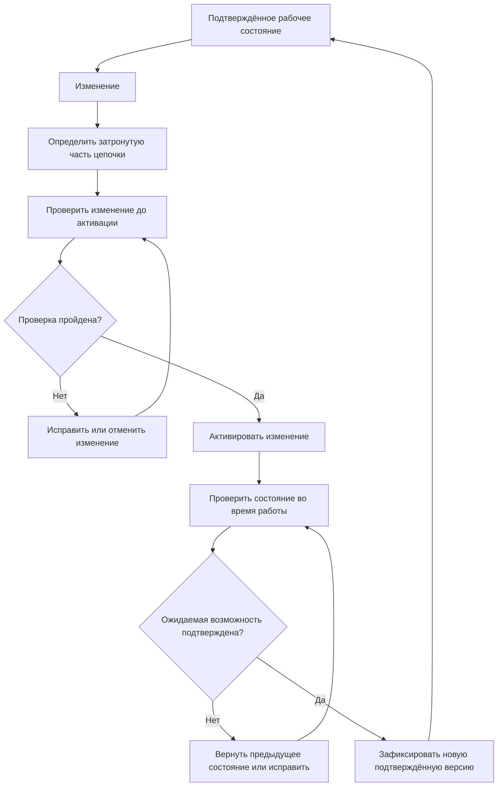

# 15. Особенности подготовки специалистов в области кибербезопасности

Специалист по кибербезопасности опирается не на один инструмент, а на фундамент: сети, операционные системы, программирование, базы данных, криптографию, модели угроз, анализ рисков и принципы защиты информации.

Практическая подготовка должна включать лабораторные эксперименты, разбор реальных кейсов, документирование, работу с журналами и сетевым трафиком, тестирование безопасности, реагирование на инциденты и основы форензики. Не менее важны этика, правовые границы и умение работать только в разрешённых границах (scope).

Профессиональная компетентность требует постоянного обновления знаний: стандарты, RFC, security advisories, документация продуктов и сертификации помогают поддерживать общую рамку, но не заменяют практическую проверку навыков.

## Профессиональная компетенция — воспроизводимый вывод

Специалист по IDS/IPS должен уметь не только запускать инструмент, но и обосновывать границы проверки, выбирать сенсор, тестировать правила, сохранять raw evidence, оценивать ложные срабатывания и оформлять отчёт. Различайте результаты лаборатории, рекомендации и подтверждённые выводы. Любая проверка инфраструктуры выполняется только в установленном scope и в разрешённое время.

## Подготовка и практика специалиста

### Профессия начинается с задач, а не с названий продуктов

У разных специалистов набор обязанностей различается, но типовые инженерные задачи можно описать без привязки к конкретному вендору:

```text
понять активы и требования
        ↓
оценить угрозы, уязвимости и риск
        ↓
спроектировать / настроить защиту
        ↓
наблюдать состояние системы
        ↓
обнаруживать и проверять отклонения
        ↓
реагировать и восстанавливать
        ↓
документировать результат
        ↓
улучшать систему по итогам проверки
```

NICE Framework описывает работу в кибербезопасности через рабочие роли, задачи, знания и навыки. Для курса важен сам принцип: **должность не равна одному набору инструментов**, а профессиональная готовность определяется тем, какие задачи человек способен выполнять и обосновывать.

---


### Фундаментальные области знаний

Специалисту не требуется одинаковая глубина во всех областях, но без базового фундамента трудно интерпретировать технические события.

| Область | Зачем она нужна |
|---|---|
| Сети и протоколы | понимать маршрутизацию, адресацию, состояние соединений, точки наблюдения и сетевые следы |
| Windows/Linux и архитектура ОС | понимать процессы, права, файлы, журналы, службы и хостовую телеметрию |
| Программирование и автоматизация | читать логику программ, писать проверки, автоматизировать повторяемые задачи и понимать ошибки реализации; в учебной практике полезны Python, C и JavaScript как примеры разных типов задач |
| Математическая и аналитическая база | понимать вероятности, метрики, объёмы данных и ограничения количественных выводов, когда они применяются в анализе безопасности |
| Базы данных | понимать хранение, права, запросы, аудит и последствия прикладных атак |
| Криптография | понимать, что именно защищает шифрование, подпись, хеширование и управление ключами |
| Безопасность приложений | понимать аутентификацию, авторизацию, обработку данных, API и жизненный цикл разработки |
| Риск и управление ИБ | связывать технический факт с активом, последствиями и приоритетом обработки |

<div class="principle-box">
<strong>ЗНАТЬ ТЕРМИН ≠ УМЕТЬ ВЫПОЛНИТЬ ЗАДАЧУ</strong>
<p>Навык появляется, когда студент может применить знание в конкретной среде, получить проверяемый результат, объяснить ограничения и повторить процедуру.</p>
</div>

---


### Технические направления профессиональной практики

В реальной работе области пересекаются. Например, один инцидент может потребовать сетевого анализа, расследования на конечной системе и проверки приложения.

К базовым направлениям относятся:

- анализ уязвимостей и безопасной конфигурации;
- тестирование безопасности и проверка исправлений;
- мониторинг и detection engineering;
- администрирование защитных средств;
- реагирование на инциденты;
- цифровая форензика и сохранение артефактов;
- безопасность приложений и DevSecOps;
- управление идентификацией и доступом;
- защита сетевой и облачной инфраструктуры;
- аудит и оценка соответствия требованиям;
- понимание социальной инженерии и способов защиты пользователей от фишинговых и иных манипулятивных сценариев.

Этот курс глубже всего развивает наблюдаемость, IDPS, evidence, правила, оценку качества и эксплуатацию возможностей обнаружения. Остальные области используются настолько, насколько они нужны для понимания общей системы защиты.

---


### Лаборатория, проект и стажировка решают разные задачи

Практическая подготовка должна постепенно уменьшать объём подсказок:

```text
демонстрация
   ↓
guided lab
   ↓
лаборатория с прогнозом и проверкой
   ↓
частично самостоятельная задача
   ↓
проект / кейс
   ↓
практика или стажировка в реальной организационной среде
```

**Лаборатория** позволяет безопасно повторить контролируемый сценарий и понять причинную связь. **Проект** требует самому определить часть архитектуры, критериев и способа проверки. **Стажировка/производственная практика** добавляет реальные ограничения: существующую инфраструктуру, процессы изменений, права доступа, коммуникацию, сроки и ответственность.

Ни один из этих форматов не является достаточным сам по себе. Сильная подготовка сочетает повторяемые лабораторные эксперименты, самостоятельные задачи, анализ реальных кейсов и опыт работы с ограничениями настоящих систем.

---


### Реагирование и форензика требуют дисциплины доказательств

При инциденте важно не только «найти что-то подозрительное», но и сохранить происхождение факта:

```text
артефакт
→ источник
→ время и контекст получения
→ способ сбора
→ неизменность / целостность
→ интерпретация
→ граница вывода
```

Форензика требует аккуратного сбора и сохранения данных, чтобы последующий анализ можно было воспроизвести и проверить. В операционной работе специалист также должен отличать:

- наблюдаемый факт;
- гипотезу;
- подтверждённое действие;
- вывод об инциденте;
- предположение об источнике или мотиве.

Это продолжает основную доказательную модель курса: alert, IOC или совпадение правила — ещё не готовое объяснение произошедшего.

---


### Этика, право и разрешённые границы работы

Техническая возможность выполнить действие не означает наличие права его выполнять. До тестирования или расследования должны быть определены:

- разрешённая область работ;
- полномочия и ответственные лица;
- допустимые методы;
- правила обращения с данными;
- требования к журналированию и отчётности;
- порядок остановки работ при риске ущерба.

Особенно это важно для тестирования на проникновение, анализа пользовательских данных и действий в продуктивной инфраструктуре.

<div class="idps-equation">
  <div class="idps-equation__expression"><span>ТЕХНИЧЕСКИ МОГУ</span><b>≠</b><span>ИМЕЮ РАЗРЕШЕНИЕ</span></div>
  <p>Профессиональная компетентность включает соблюдение правовых, договорных и этических ограничений, а не только способность выполнить техническую операцию.</p>
</div>

---


### Стандарты, руководства и сертификации

Эти инструменты решают разные задачи:

| Инструмент | Для чего полезен | Чего не доказывает сам по себе |
|---|---|---|
| Стандарт / рамочная модель | задаёт требования, структуру, общий язык или практики | что конкретная система автоматически безопасна |
| Официальная документация продукта | объясняет возможности и конфигурацию конкретной реализации | что конфигурация в вашей среде действительно работает как ожидается |
| Сертификация специалиста | подтверждает прохождение определённой схемы оценки знаний/навыков | что человек способен решить любую практическую задачу |
| Лабораторный отчёт / проект | показывает выполнение конкретной задачи в заданной среде | универсальную компетентность вне проверенных условий |

Примеры широко известных сертификационных программ — CompTIA Security+, (ISC)² CISSP и EC-Council CEH. Они ориентированы на разные уровни и наборы знаний; курс не ранжирует их и не рассматривает сертификат как замену практической компетентности.

Стандарты и рамочные документы, например ISO/IEC 27001, документы NIST или требования PCI DSS в соответствующей области применения, помогают структурировать требования и процессы. Их использование также не освобождает специалиста от проверки фактической реализации.

Сертификации могут помогать структурировать обучение и подтверждать определённый уровень подготовки, но их следует рассматривать вместе с практикой, портфолио работ, способностью объяснять решения и работать с первичными источниками.

---


### Непрерывное развитие — часть профессии

Технологии, протоколы, версии продуктов и способы атак меняются. Поэтому профессиональный цикл выглядит так:

```text
изучить первичный источник
        ↓
понять изменение
        ↓
воспроизвести в лаборатории
        ↓
проверить влияние на свою систему
        ↓
обновить процедуру / правило / документацию
        ↓
сохранить воспроизводимый результат
```

Полезные привычки:

- читать RFC, стандарты, security advisories и официальные release notes;
- проверять сведения в лабораторной среде;
- вести технические заметки и журнал изменений;
- уметь объяснить, почему команда или правило работает;
- разбирать собственные ошибки и ложные предположения;
- регулярно возвращаться к базовым принципам сетей, ОС и программирования.

---


### Автоматизация, ИИ и практико-ориентированное развитие

Автоматизация и искусственный интеллект меняют рабочие процессы в кибербезопасности: помогают сортировать события, искать связи, генерировать кандидаты на правила и ускорять анализ больших объёмов данных. Но профессиональная ответственность остаётся у специалиста: нужно знать происхождение данных, ограничения модели, проверять критичные решения и уметь воспроизвести вывод без ссылки на «так сказала система».

Поэтому практико-ориентированное обучение важно не как набор инструментов, а как повторяемый цикл **задача → эксперимент → evidence → объяснение → обратная связь**. Технологии быстро меняются, и устойчивый навык состоит в способности освоить новый инструмент через первичную документацию, проверить его в контролируемой среде и корректно встроить в существующий процесс.

---


### Как этот курс формирует профессиональную готовность

Курс не пытается заменить всю программу подготовки специалиста. Он даёт проверяемый практический слой:

| Навык | Где развивается |
|---|---|
| понимание источников и границ наблюдаемости | базовые материалы по IDS/IPS и размещению, ЛР №1–3 |
| различение оснований detection logic | «Методы обнаружения подозрительной активности», ЛР №4 |
| работа с правилами и условиями | «Правила IDS/IPS и detection logic», ЛР №5 |
| критическая оценка FP/FN и ограничений | материалы по ограничениям и оценке эффективности |
| протоколы, шифрование и прикладной контекст | темы 9–13 и подробные материалы по протоколам/приложениям |
| поддержание работоспособности после изменений | «Сопровождение возможностей обнаружения» |
| сопоставление нескольких источников | «Корреляция нескольких источников и контекст угроз» |
| доказательное документирование | проходит через все лабораторные работы |

Следующий уровень подготовки должен требовать больше самостоятельности: студент сам формулирует критерий, выбирает источник данных, проектирует проверку и защищает границы своего вывода.

---


## Эксплуатация и проверка изменений

### Подтверждённая возможность обнаружения существует только в конкретном состоянии

В Главе 8 мы уже фиксировали версию, конфигурацию, набор данных и условия оценки. Теперь сделаем следующий шаг.

Результат проверки относится не к абстрактной «IDS вообще», а к конкретному состоянию:

<div class="idps-responsive-shell">
<div class="idps-grid idps-grid--3">
  <div class="idps-card idps-card--source"><span class="idps-card__eyebrow">ДАННЫЕ</span><strong class="idps-card__title">Источник и точка наблюдения</strong><p>Откуда система получает данные, где расположен сенсор и какой трафик или телеметрия реально проходят через эту точку.</p></div>
  <div class="idps-card idps-card--sensor"><span class="idps-card__eyebrow">ОБРАБОТКА</span><strong class="idps-card__title">Движок и конфигурация</strong><p>Версия программы, включённые протокольные анализаторы, параметры потоков, ограничения ресурсов и другие настройки.</p></div>
  <div class="idps-card idps-card--result"><span class="idps-card__eyebrow">ОБНАРУЖЕНИЕ</span><strong class="idps-card__title">Набор правил и вывод</strong><p>Активные правила, пороги, подавление, способ формирования и доставки результата.</p></div>
</div>
</div>

Если меняется хотя бы один из этих элементов, прежний тест остаётся историческим доказательством **предыдущего состояния**. Он не исчезает, но его нельзя автоматически переносить на новое.

Это не означает, что после любого изменения нужно полностью повторять всю оценку системы. Масштаб повторной проверки должен соответствовать тому, **что именно могло измениться в причинной цепочке**.

---


### Какие изменения способны изменить результат обнаружения

Не все изменения одинаковы. Полезно различать хотя бы пять классов.

<div class="idps-axis-table-wrap">
<table class="idps-axis-table">
<thead>
<tr>
<th>Что изменилось</th>
<th>Что может измениться в IDPS</th>
<th>Какой вопрос нужно проверить</th>
</tr>
</thead>
<tbody>
<tr>
<td data-label="Что изменилось">Набор правил</td>
<td data-label="Что может измениться в IDPS">Условия совпадения, исключения, приоритеты, пороги, включённые и отключённые правила</td>
<td data-label="Что нужно проверить">Активна ли ожидаемая версия и сохраняются ли положительные/отрицательные результаты?</td>
</tr>
<tr>
<td data-label="Что изменилось">Конфигурация</td>
<td data-label="Что может измениться в IDPS">Область действия правил, переменные сети, протокольные параметры, лимиты памяти, вывод событий</td>
<td data-label="Что нужно проверить">Не изменилась ли область применимости или путь результата?</td>
</tr>
<tr>
<td data-label="Что изменилось">Движок или протокольный анализатор</td>
<td data-label="Что может измениться в IDPS">Разбор протокола, нормализация, поддерживаемые поля, состояние потоков, поведение правил</td>
<td data-label="Что нужно проверить">Совпадает ли доступное представление с тем, на котором проверялось условие?</td>
</tr>
<tr>
<td data-label="Что изменилось">Топология или точка наблюдения</td>
<td data-label="Что может измениться в IDPS">Набор реально наблюдаемого трафика, направление, место до/после шифрования или преобразования</td>
<td data-label="Что нужно проверить">Попадает ли нужный обмен в сенсор и в прежнем ли представлении?</td>
</tr>
<tr>
<td data-label="Что изменилось">Нагрузка или путь вывода</td>
<td data-label="Что может измениться в IDPS">Потери пакетов, разрывы восстановления потока, очереди, задержка и доставка оповещений</td>
<td data-label="Что нужно проверить">Получает ли движок нужные данные и доходит ли результат до потребителя?</td>
</tr>
</tbody>
</table>
<div class="idps-axis-table__note"><strong>Главная идея:</strong> изменение может происходить далеко от текста правила, но всё равно менять доказанную возможность обнаружения.</div>
</div>

Поэтому «правило не меняли» ещё не означает «возможность обнаружения не менялась».

---


### Жизненный цикл — это цикл подтверждения, а не список административных команд

Для курса используем следующую **инженерную модель**. Это не универсальный стандарт жизненного цикла для всех продуктов, а способ не потерять связь между изменением и доказательством.



Здесь принципиальны две разные проверки:

1. **до активации** — корректен ли сам изменённый набор правил/конфигурации и проходит ли он контролируемые тесты;
2. **после активации** — действительно ли рабочая система загрузила нужное состояние, получает данные и формирует ожидаемый результат.

Первая проверка не заменяет вторую.

---


### Что нужно фиксировать, чтобы изменение можно было воспроизвести

В Главе 8 повторяемость была свойством оценки. В эксплуатации она становится свойством рабочего состояния.

Минимальная запись об изменении должна позволять ответить:

<div class="idps-responsive-shell">
<div class="idps-question-model idps-question-model--four">
  <div class="idps-question-model__cell"><span>Что изменили?</span><strong>Файл правила, набор правил, конфигурацию, движок, топологию, источник данных или путь вывода.</strong></div>
  <div class="idps-question-model__cell"><span>Из какого состояния?</span><strong>Какая версия была активна до изменения и какими тестами она была подтверждена.</strong></div>
  <div class="idps-question-model__cell"><span>Какое состояние стало новым?</span><strong>Версия движка, набор правил, конфигурация и другие параметры, влияющие на проверяемую возможность.</strong></div>
  <div class="idps-question-model__cell"><span>Чем подтверждено?</span><strong>Результаты положительных, отрицательных и при необходимости вариантных тестов, а также наблюдения рабочей системы после активации.</strong></div>
  <div class="idps-question-model__boundary"><strong>Граница доказательности:</strong> запись версии позволяет воспроизвести состояние, но сама по себе не доказывает качество обнаружения.</div>
</div>
</div>

Для конкретного набора правил полезно иметь однозначный идентификатор версии: номер выпуска, идентификатор изменения, контрольную сумму файла или иной воспроизводимый признак. Способ зависит от среды; важно не название механизма, а возможность точно восстановить, **что было активно в момент наблюдения**.

---


### Что нужно запомнить

1. Возможность обнаружения подтверждается для конкретного состояния источника, движка, конфигурации, набора правил и пути результата.
2. Изменение правила — только один из способов изменить обнаружение; конфигурация, движок, топология и нагрузка тоже важны.
3. «Файл обновлён», «правила загружены» и «ожидаемое обнаружение подтверждено» — три разных утверждения.
4. Предварительная проверка и проверка после активации отвечают на разные вопросы.
5. Работоспособность процесса не доказывает получение нужных данных, корректность представления или доставку результата.
6. Эксплуатационные счётчики являются наблюдениями и помогают локализовать проблему, но не заменяют причинного анализа конкретного события.
7. Версия и конфигурация сенсора являются частью контекста доказательства.
8. Существенное изменение должно иметь понятное предыдущее состояние и проверяемый путь возврата.
9. Автоматизация полезна, когда сохраняет и проверяет свидетельства, а не только ускоряет применение изменений.
10. Suricata в этой теме показывает конкретные механизмы управления правилами и рабочим состоянием, но не задаёт универсальную эксплуатационную модель всех IDPS.

---


## Проверьте себя

Выберите ответ. После выбора появится пояснение. При необходимости перечитайте соответствующий раздел этой же темы.

<div class="quiz" data-question-id="topic15-q1">
  <p><strong>Что должно быть в отчёте о тесте правила?</strong></p>
  <button type="button" data-choice="0">А. Только сводный скрин без исходных записей</button>
  <button type="button" data-choice="1" data-correct="true">Б. Условия, raw logs и ограничения</button>
  <button type="button" data-choice="2">В. Только имя правила и номер детектора без сценария</button>
  <button type="button" data-choice="3">Г. Только общий счётчик alert без тестовых условий</button>
  <div class="quiz-feedback" data-explanation="Результат должен быть воспроизводимым: настройки, входные события, исходные журналы, ограничения." aria-live="polite"></div>
</div>

<div class="quiz" data-question-id="topic15-q2">
  <p><strong>Почему эксплуатационные изменения требуют повторного QA?</strong></p>
  <button type="button" data-choice="0" data-correct="true">А. Могут менять фактическую детекцию</button>
  <button type="button" data-choice="1">Б. Любое обновление доказывает компрометацию</button>
  <button type="button" data-choice="2">В. Изменения затрагивают лишь формат консольного отчёта</button>
  <button type="button" data-choice="3">Г. Процесс загрузки правил всегда гарантирует детекцию</button>
  <div class="quiz-feedback" data-explanation="Новые правила, версии и нагрузка влияют на условия обнаружения." aria-live="polite"></div>
</div>

<div class="quiz" data-question-id="topic15-q3">
  <p><strong>Какая последовательность верна для эксперимента?</strong></p>
  <button type="button" data-choice="0">А. Оповещение → вывод без проверки первичных данных</button>
  <button type="button" data-choice="1" data-correct="true">Б. Scope → действие → evidence → вывод</button>
  <button type="button" data-choice="2">В. Готовый вывод → эксперимент без согласованного scope</button>
  <button type="button" data-choice="3">Г. Запуск инструмента → действие вне границ оценки</button>
  <div class="quiz-feedback" data-explanation="Разрешённый scope предшествует эксперименту, вывод подтверждается артефактами." aria-live="polite"></div>
</div>

## Навигация

[← Тема 14](./14-antivirus-proactive.md) · [Все 15 тем](../syllabus/index.md)

