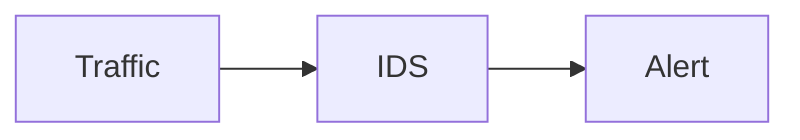

# Визуальные элементы курса

Курс использует несколько типов визуализации. Выбор формата определяется не декоративностью, а тем, какой учебный вопрос должен быть понятен студенту.

| Тип | Когда использовать |
|---|---|
| Mermaid | Простые архитектурные схемы, flowchart, sequence diagram, часто меняющиеся вместе с текстом |
| HTML + CSS | Карточки, сравнения, семантические блоки, небольшие учебные модели и responsive-композиции |
| SVG + CSS | Сложные технические схемы, где требуется точная геометрия стрелок и расположения элементов |
| JavaScript | Только полезная интерактивность: переключение представлений, фокус на слоях, раскрытие пояснений; без JS содержание должно оставаться доступным |
| PNG/WebP | Реальные скриншоты Wireshark, Suricata, Wazuh и других интерфейсов/CLI, когда важен фактический вид результата |
| GIF/animated WebP | Короткая демонстрация динамического процесса, если статическая последовательность хуже объясняет механизм |
| Content Tabs | Разделение ролей, ОС, Client/Sensor/Target |
| Code Annotations | Пояснение отдельных параметров конфигурации |

!!! tip
    Mermaid используется для схем, которые часто меняются вместе с текстом. Сложные схемы не следует насильно помещать в Mermaid: читабельность важнее унификации.

## Design system курса

Базовая реализация:

```text
docs/assets/stylesheets/extra.css        — существующие стили страниц
docs/assets/stylesheets/idps-system.css  — переиспользуемые семантические компоненты
docs/assets/javascripts/course.js         — существующая логика курса
docs/assets/javascripts/idps-system.js    — progressive enhancement для новых компонентов
```

Новые компоненты должны использовать namespace `idps-`, чтобы не конфликтовать с MkDocs Material и историческими стилями курса.

### Семантические роли

Одинаковый цвет в разных главах означает одну и ту же роль:

| Роль | Класс | Значение |
|---|---|---|
| Endpoint | `idps-node--endpoint` | клиент, сервер, иной конечный узел |
| Observation | `idps-node--observation` | точка наблюдения |
| Sensor | `idps-node--sensor` | средство/сенсор анализа |
| Source | `idps-node--source` | источник или журнал наблюдаемых данных |
| Result | `idps-node--result` | результат обнаружения, например alert |
| Interpretation | `idps-node--interpretation` | проверка, интерпретация, допустимый вывод |

Цвет не должен быть единственным носителем смысла: роль также задаётся текстом, положением и подписью.

### Семантика связей

Во всех главах придерживаться одной модели:

```text
сплошная связь       — основной поток / непосредственное взаимодействие
пунктирная связь     — копия наблюдаемых данных
otдельная ветвь      — журналирование / телеметрия / иной независимый источник
result → interpretation — результат анализа передаётся на проверку/интерпретацию
```

Не смешивать в одном визуальном объекте:

```text
источник данных
≠ точка наблюдения
≠ способ получения данных
≠ система анализа
≠ результат обнаружения
≠ управляющее воздействие
```

## JavaScript: правило применения

JavaScript не используется для того, чтобы сделать статическую схему «красивее». Он применяется только тогда, когда действие студента добавляет учебную ценность: например, переключает две защитные функции или подсвечивает, какие данные доступны конкретному наблюдателю.

Обязательные требования:

1. без JavaScript весь обязательный материал остаётся читаемым;
2. элементы управления доступны с клавиатуры;
3. состояние не должно изменять смысл исходного материала;
4. JS не генерирует технические утверждения — он только переключает заранее записанный контент;
5. перед релизом выполняется `node --check` для каждого JS-файла.

## Пример Mermaid



## Требование к растровым и SVG-иллюстрациям

Добавляйте изображение только вместе с реальным файлом в `docs/assets/images/` и содержательной подписью. Путь в учебной странице должен указывать на существующий ассет; фиктивные `example.svg` и другие демонстрационные ссылки не используются.

Иллюстрация должна отвечать на конкретный учебный вопрос и различать семантически разные связи: основной сетевой поток, копию наблюдаемого трафика, телеметрию и управляющее воздействие.

## Reference implementation: Глава 1

Начиная с `v2.29-rc4`, `docs/course/01-intro.md` является эталонной страницей для нового HTML/CSS visual layer.

Переиспользуемые компоненты:

| Компонент | Назначение |
|---|---|
| `idps-figure` | единая оболочка для Mermaid/SVG с label и caption |
| `idps-policy-list` | набор решений allow/deny |
| `idps-equation` | ключевые отношения вида `A ≠ B` |
| `idps-grid` + `idps-card` | сравнения и небольшие концептуальные карточки |
| `idps-switcher` | progressive-enhancement переключение заранее записанных представлений |
| `idps-process` | короткая линейная модель процесса |
| `idps-result-card` | явно выделенный результат обнаружения |
| `idps-evidence-grid` | граница доказательной силы: подтверждено / не подтверждено |
| `idps-contrast` | функциональное сравнение с направлением перехода |
| `idps-decision` | одиночное решение политики |
| `idps-stack` | несколько функций внутри одной платформы/продукта |
| `idps-summary-grid` | итоговые тезисы главы |

Для нового визуального кода не создавать one-off классы, если задачу уже покрывает один из этих компонентов.

### Важное правило для пунктирных связей

В актуальном visual layer пунктирная стрелка резервируется за смыслом **«копия наблюдаемых данных / телеметрии»**. Не использовать пунктир только как декоративное обозначение «запрещено», «альтернативный путь» или «тот же путь». Если связь имеет другой смысл, выбирается другая структура схемы или явная подпись без пунктирной семантики.
